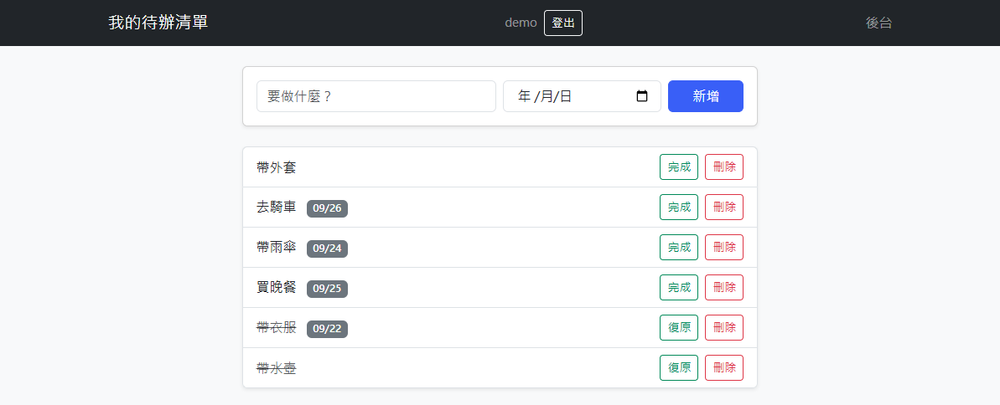

# 待辦清單 · Todo

[](https://github.com/RyanWu9863/personal_system/actions/workflows/tests.yml)

多人待辦清單。同一份資料有兩種用法：**網頁介面**給人用，**JSON API**給程式用，兩邊共用同一套驗證規則。附 25 個測試，測試不通過就不會部署。

**線上 Demo** → <https://personal-system-r5pf.onrender.com>
Render 免費方案會休眠，第一次開啟約需等 30 秒。測試帳號：`demo` / `zxcv123456`



**技術**：Django 5.2 · PostgreSQL（本機 SQLite）· WhiteNoise · Gunicorn · 部署於 Render

---

## 專案結構

```
config/          專案設定
  settings.py    環境變數驅動；正式環境的安全設定用 if not DEBUG 隔開
  urls.py        / → 網頁、/api/ → JSON API、/accounts/ → 內建認證
todo/
  models.py      Task（待辦）、ApiToken（API 用的身分憑證）
  forms.py       TaskForm 驗證規則；TaskApiForm 繼承它，只多開放 is_done
  views.py       網頁介面：清單、新增、切換完成、刪除
  api.py         JSON API：token 認證、統一錯誤格式、序列化
  tests.py       25 個測試
build.sh         部署腳本：安裝 → 跑測試 → 收集靜態檔 → 資料庫遷移
```

## 設計決策

**資料隔離寫在查詢層**　每次讀寫都帶 `owner=request.user` 過濾，不是取出來才檢查。越權存取回 **404 而非 403**，避免洩漏「這筆資料存在」。三個測試守著這件事。

**驗證規則只寫一次**　網頁與 API 共用 `TaskForm`，所以「標題至少 2 字」「不能有重複的未完成待辦」在兩邊行為完全一致。API 版只透過繼承多開放 `is_done` 欄位。

**PATCH 是真正的部分更新**　先讀資料庫現值當底，再蓋上這次送來的欄位。只送 `is_done` 不會把標題清空——這是實作時踩到的坑，現在有測試釘住。

**錯誤格式統一**　所有 API 錯誤都是 `{"error": {"code", "message", "fields?"}}`。壞 JSON 回 400 而不是 500，欄位驗證失敗會回傳是哪個欄位錯。

**安全設定只在正式環境生效**　HTTPS 強制轉址、Secure cookie、靜態檔 manifest 都包在 `if not DEBUG` 裡，本機開發與測試不會被轉址干擾。

**token 輪替而非累積**　重新產生時覆寫同一筆記錄的金鑰，而不是多開一筆。一個使用者永遠只有一把有效 token，舊的立刻失效——金鑰外流時使用者能自行處理，不需要管理員介入。輪替端點只收 POST，避免被 GET 誤觸。

**測試是部署的前置條件**　`build.sh` 裡 `manage.py test` 失敗就中斷，壞的程式碼進不了正式環境。

## API

登入後在 `/token/` 自助產生 token，以 `Authorization: Bearer <token>` 帶入。
重新產生會直接輪替同一筆記錄的金鑰，舊的立刻失效。

| 方法 | 路徑 | 說明 |
|---|---|---|
| GET | `/api/tasks/` | 列出自己的待辦 |
| POST | `/api/tasks/` | 新增 |
| GET | `/api/tasks/<id>/` | 讀取單筆 |
| PATCH | `/api/tasks/<id>/` | 部分更新，只送要改的欄位 |
| DELETE | `/api/tasks/<id>/` | 刪除，回 204 |

```bash
curl -H "Authorization: Bearer $TOKEN" https://personal-system-r5pf.onrender.com/api/tasks/
```

沒帶 token 會得到：

```json
{"error": {"code": "unauthorized", "message": "缺少或無效的 API token"}}
```

## 測試

```bash
DEBUG=True DATABASE_URL="sqlite:///build-test.sqlite3" python manage.py test
```

用開發設定跑，避開正式環境的 HTTPS 強制轉址。

每次 push 與 PR 會由 GitHub Actions 自動執行同一套測試，並額外以正式環境的設定組合跑一次 `manage.py check --deploy`。涵蓋範圍：

- **權限與資料隔離**　未登入導向登入頁、清單只顯示自己的、不能刪別人的
- **表單驗證**　標題太短被擋、弱密碼回傳表單而非 500
- **API 認證**　缺 token 與無效 token 都回 401
- **API 行為**　歸屬正確、壞 JSON 回 400、部分更新不清空其他欄位、404 也是 JSON 格式、日期序列化為 `YYYY-MM-DD`

## 本機執行

```bash
python -m venv .venv && source .venv/Scripts/activate   # Windows；macOS/Linux 用 .venv/bin/activate
pip install -r requirements.txt
python manage.py migrate
python manage.py runserver
```

## 已知取捨與下一步

- **手寫 API 而非用 Django REST Framework**：為了看清認證、序列化、錯誤處理各自在做什麼。專案再長大就該換成 DRF。
- **API token 以明文存放**。真實系統應只存雜湊、且只在產生當下顯示一次；這裡為了讓使用者隨時查得到而保留明文，改動範圍不大但會犧牲可查看性。
- **測試只跑一個 Python 版本**（3.13），也還沒量測涵蓋率。
